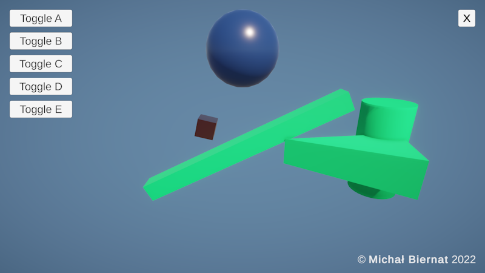

# Physics Sim - GJK

<p align="center"></p>

## About

The project is an implementation of the **Gilbert-Johnson-Keerthi (GJK)** algorithm to check for intersections between custom mesh colliders.

A working demo is available in the releases.

## Tools & Dependencies

 - [Unity 2021.3.0](https://unity.com/releases/editor/whats-new/2021.3.0) - game engine;
 - [Blender 2.93](https://www.blender.org/download/releases/2-93/) - to create 3D models;

*The project requires Blender installed because of ```.blend``` files.*

## Credits

**Michał Biernat** @[m-biernat](https://github.com/m-biernat)

## License

Licensed under [MIT license](LICENSE.md).
